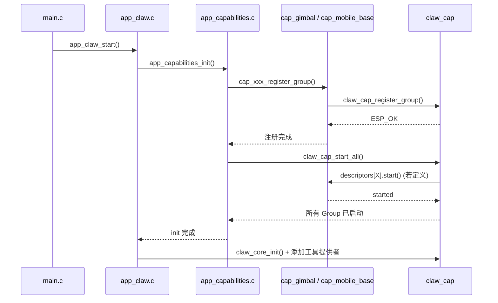

# 开发者 6 — Capability 模块：摄像头舵机 / 四轮移动底座开发计划

## 概述

本计划针对**Capability 模块负责人**，在现有 爱莉 Edge Agent 能力系统中扩展物理外设控制层。开发者将从两个候选方向中选择或分阶段推进：

1. **摄像头舵机云台（Camera Gimbal / 摄像头舵机）** — 通过 PWM/舵机控制摄像头俯仰与旋转，结合视频画面实现 AI 视觉跟随、巡检等场景
2. **四轮移动底座（4-Wheel Mobile Base / 四轮移动底座）** — 通过直流电机驱动四轮底盘，实现遥控移动、路径规划、自主巡航等场景

两个方向共享同一套 Capability 注册/调用框架，但硬件接口与执行逻辑不同。本文档同时提供两套完整的技术方案，开发者可根据项目阶段和硬件资源选择实现顺序。

---

## 目录

1. [技术背景与系统架构定位](#1-技术背景与系统架构定位)
2. [方案 A：摄像头舵机云台 Capability](#2-方案a摄像头舵机云台-capability)
3. [方案 B：四轮移动底座 Capability](#3-方案b四轮移动底座-capability)
4. [公共基础设施：硬件抽象层](#4-公共基础设施硬件抽象层)
5. [Skills 与 LLM 集成设计](#5-skills-与-llm-集成设计)
6. [Web 前端控制面板（可选）](#6-web-前端控制面板可选)
7. [Event Router 自动化场景](#7-event-router-自动化场景)
8. [测试与验证方案](#8-测试与验证方案)
9. [风险与缓解措施](#9-风险与缓解措施)
10. [开发里程碑与时间估算](#10-开发里程碑与时间估算)
11. [依赖项与参考资源](#11-依赖项与参考资源)

---

## 1. 技术背景与系统架构定位

### 1.1 Capability 体系回顾

爱莉 中所有硬件控制均通过 **Capability（能力）** 抽象单元接入系统。每个硬件功能组件作为一个 `cap_*` 组件，向 `claw_cap` 注册描述符（`claw_cap_descriptor_t`），通过统一入口路由调用。

当前系统中已有可参考的硬件相关 Capability：
- **`cap_voice`** — TTS 语音合成（通过 WebSocket 连接外部服务，驱动板载音频 DAC）
- **`cap_system`** — 查询系统内存/CPU/网络信息
- **`cap_boards`** — 板级管理

### 1.2 硬件平台能力

目标硬件：**ESP32-P4-WiFi6-Touch-LCD-4.3**（或其他板）：
- CPU：ESP32-P4（双核 400MHz，带 PPA/向量扩展）
- 内存：32MB PSRAM + 768KB HP L2MEM
- 存储：32MB NOR Flash
- 连接：Wi-Fi 6（802.11ax）、BLE 5.0
- 显示：4.3" 触摸 LCD（ST7701 + GT911）
- 外设接口：GPIO、I2C、SPI、UART、MCPWM（PWM 发生器）、PCNT（脉冲计数器）

ESP32-P4 的 **MCPWM** 和 **PCNT** 外设特别适合舵机控制和电机编码器输入。

### 1.3 设计原则

| 原则 | 说明 |
|------|------|
| **非阻塞执行** | 硬件操作（特别是连续运动）必须在后台任务执行，Execute 回调只做参数校验和任务启动 |
| **状态管理** | 云台/底座的当前位置、速度、运动状态等通过模块内部结构体维护，提供查询工具 |
| **安全限位** | 物理限位开关（如果有）必须接入，软件层面也要设最大角度/速度保护 |
| **热插拔感知** | 外设可能未连接，Capability 注册成功但工具调用时应返回明确的未连接错误 |
| **资源复用** | MCPWM 定时器等硬件资源可能被其他模块共享（如音频输出 I2S），需通过 Kconfig 协调 |

---

## 2. 方案 A：摄像头舵机云台 Capability

### 2.1 功能描述

提供 2 自由度（2-DOF）摄像头云台控制，支持：
- **设置俯仰角**（Pitch，上下转动）
- **设置水平角**（Yaw，左右转动）
- **查询当前角度**
- **归零/校准**
- **连续扫描**（在两个角度之间往复运动）
- **AI 视觉跟随**（与 video_player 画面分析联动，自动跟踪画面中目标）

### 2.2 硬件选型建议

| 组件 | 推荐型号 | 说明 |
|------|---------|------|
| 舵机 x2 | SG90 / MG996R | 5V 供电，PWM 控制（50Hz，0.5~2.5ms 脉冲） |
| 云台支架 | 2-DOF 铝合金云台 | 市场通用摄像头云台支架 |
| 电平转换 | 3.3V → 5V 电平转换模块 | ESP32 的 GPIO 为 3.3V，舵机需 5V 信号 |
| 外部电源 | 5V/2A 独立供电 | 舵机瞬时电流可达 1A+，避免从 ESP32 3.3V 取电 |
| 可选：限位开关 | 微动开关 x2 | 用于云台归零校准 |

### 2.3 舵机控制原理

标准舵机通过 **50Hz PWM 信号**控制角度：
- 脉冲宽度 0.5ms → -90°
- 脉冲宽度 1.5ms → 0°（中位）
- 脉冲宽度 2.5ms → +90°

ESP32-P4 的 **MCPWM** 外设可精确生成所需 PWM 信号，且不占用 CPU 资源。

### 2.4 Capability 设计

#### 2.4.1 描述符清单

| id | name | description | 调用方式 |
|----|------|-------------|---------|
| `gimbal_set_angle` | 设置云台角度 | 设置俯仰和水平角度（度） | CALLABLE |
| `gimbal_get_status` | 查询云台状态 | 获取当前角度和运动状态 | CALLABLE |
| `gimbal_home` | 归零校准 | 回到中位并校准 | CALLABLE |
| `gimbal_scan` | 连续扫描 | 在指定角度范围内往复扫描 | CALLABLE/HYBRID |
| `gimbal_event` | 云台事件 | 产生到位/限位触发事件 | EVENT_SOURCE |

#### 2.4.2 Executes 核心逻辑

##### `gimbal_set_angle` 执行流程图

```
输入: {"pitch": 30, "yaw": -45, "speed": 0.5}
  ↓
参数校验: pitch ∈ [-90, 90], yaw ∈ [-90, 90], speed ∈ [0.1, 1.0]
  ↓
速度计算: delay_ms = (1.0 - speed) * 500 + 100  // 100~600ms 过渡
  ↓
如果当前有正在执行的扫描/跟随任务 → 取消并等待
  ↓
提交到运动队列（FreeRTOS Queue）
  ↓
返回: {"status": "moving", "target_pitch": 30, "target_yaw": -45}
```

##### 后台运动任务逻辑

```c
static void gimbal_motion_task(void *arg) {
    while (s_motion_active) {
        gimbal_cmd_t cmd;
        if (xQueueReceive(s_motion_queue, &cmd, pdMS_TO_TICKS(50))) {
            // 根据 cmd 类型执行
            switch (cmd.type) {
            case CMD_ANGLE:
                smooth_move_to(cmd.pitch, cmd.yaw, cmd.duration_ms);
                break;
            case CMD_SCAN:
                while (scanning) {
                    smooth_move_to(scan_min, 0, scan_speed);
                    smooth_move_to(scan_max, 0, scan_speed);
                }
                break;
            case CMD_FOLLOW:
                // 从队列接收视觉坐标并转换
                break;
            }
        }
        // 检查限位开关（如果有）
        check_limit_switches();
    }
    vTaskDelete(NULL);
}
```

### 2.5 舵机角度与脉冲宽度转换

```c
// 角度到脉冲宽度 (微秒)
// angle: -90 ~ +90, 对应脉宽 500 ~ 2500 us
static uint32_t angle_to_pulse(int angle) {
    // 线性映射
    return (uint32_t)((angle + 90) * (2000.0f / 180.0f) + 500);
}

// 设置 MCPWM 比较器
static esp_err_t gimbal_set_servo_angle(mcpwm_timer_handle_t timer,
                                         mcpwm_cmpr_handle_t comparator,
                                         int angle) {
    uint32_t pulse_us = angle_to_pulse(angle);
    uint32_t duty = pulse_us * 1000 / 20000;  // 占空比千分比 (20ms 周期)
    ESP_ERROR_CHECK(mcpwm_comparator_set_compare_value(comparator, duty));
    return ESP_OK;
}
```

### 2.6 文件结构

```
components/claw_capabilities/cap_gimbal/
├── CMakeLists.txt
├── include/
│   └── cap_gimbal.h                # 头文件，暴露 register 函数
├── src/
│   ├── cap_gimbal.c                # Capability 注册、描述符、execute 回调
│   ├── cap_gimbal_hal.c            # 硬件抽象层：MCPWM 初始化、角度控制
│   └── cap_gimbal_hal.h            # HAL 头文件
└── skills/
    └── cap_gimbal/
        └── SKILL.md                # Skill 元数据文档
```

### 2.7 Kconfig 选项

```kconfig
menu "Capability: Camera Gimbal"
    config APP_CLAW_CAP_GIMBAL
        bool "Enable Camera Gimbal Capability"
        default n
        help
            Enable control of a 2-DOF camera gimbal via PWM servo.

    config APP_CLAW_CAP_GIMBAL_PITCH_GPIO
        int "Pitch Servo GPIO"
        range 0 48
        default 4
        help
            GPIO pin for pitch servo PWM signal.

    config APP_CLAW_CAP_GIMBAL_YAW_GPIO
        int "Yaw Servo GPIO"
        range 0 48
        default 5
        help
            GPIO pin for yaw servo PWM signal.

    config APP_CLAW_CAP_GIMBAL_MCPWM_TIMER
        int "MCPWM Timer Group"
        range 0 1
        default 0
        help
            MCPWM timer group to use for servo control.
endmenu
```

---

## 3. 方案 B：四轮移动底座 Capability

### 3.1 功能描述

提供四轮独立驱动或差速驱动底盘控制，支持：
- **前进/后退/转向**（线速度 + 角速度）
- **目标位置移动**（相对位移）
- **急停/缓停**
- **查询当前状态**（速度、电量、里程）
- **编码器里程计**（通过 PCNT 脉冲计数器读取）
- **PID 速度闭环**（可选，编码器反馈）
- **自动避障**（可选，接入超声波/红外传感器）

### 3.2 硬件选型方案

#### 方案 B1：L298N + 直流减速电机（入门级）

| 组件 | 推荐型号 | 说明 |
|------|---------|------|
| 电机驱动 | L298N 模块 | 双 H 桥，驱动 2 个电机（或 4 个用 2 块） |
| 直流电机 x4 | N20 微型减速电机（6V） | 带编码器型号可选，减速比 1:30~1:100 |
| 车轮 x4 | 65mm 橡胶轮 | 适配 N20 电机轴 |
| 底盘 | 亚克力/铝合金 4WD 底盘 | 市场标准四轮小车底盘 |
| 电池 | 7.4V 18650 x2（串联） | 通过 L298N 的 12V 输入供电 |
| 稳压模块 | LM2596（降压至 5V） | 为 ESP32 和舵机供电 |
| 编码器 | 电机自带霍尔编码器 | 接入 PCNT 外设 |

#### 方案 B2：TB6612FNG + 编码器电机（进阶级）

| 组件 | 推荐型号 | 说明 |
|------|---------|------|
| 电机驱动 | TB6612FNG | 双 H 桥，效率高于 L298N，体积更小 |
| 直流电机 x4 | JGB37-520 编码器电机 | 带 11 线编码器，分辨率更高 |
| 其他 | 同方案 B1 |  |

### 3.3 运动学模型

#### 差速驱动

```
左轮速度: v_L = v - ω * W/2
右轮速度: v_R = v + ω * W/2
```
其中 v = 线速度, ω = 角速度, W = 轮距

#### 四轮独立驱动（阿克曼/麦轮）

若使用 Mecanum 轮，需独立控制四个轮子：

```
前左: v_FL = v_x - v_y - ω * (W/2 + L/2)
前右: v_FR = v_x + v_y + ω * (W/2 + L/2)
后左: v_RL = v_x + v_y - ω * (W/2 + L/2)
后右: v_RR = v_x - v_y + ω * (W/2 + L/2)
```
其中 v_x = 纵向速度, v_y = 横向速度, ω = 角速度, W = 轮距, L = 轴距

### 3.4 Capability 设计

#### 3.4.1 描述符清单

| id | name | description | 调用方式 |
|----|------|-------------|---------|
| `base_move` | 底盘移动 | 设置线速度与角速度 | CALLABLE |
| `base_stop` | 急停 | 立即停止所有电机 | CALLABLE |
| `base_goto` | 移动到目标位置 | 相对当前位移（mm） | CALLABLE |
| `base_get_status` | 查询底盘状态 | 速度、里程、电池等 | CALLABLE |
| `base_event` | 底盘事件 | 到位、碰撞、低电量等事件 | EVENT_SOURCE |

#### 3.4.2 Execute 核心逻辑

##### `base_move` 执行流程图

```
输入: {"linear_x": 0.5, "angular_z": 0.2, "duration": 5.0}
  ↓
参数校验: linear_x ∈ [-1.0, 1.0], angular_z ∈ [-1.0, 1.0]
  ↓
运动学解算:
  v_L = linear_x - angular_z * W/2    // 左轮目标速度
  v_R = linear_x + angular_z * W/2    // 右轮目标速度
  ↓
如果启用 PID：
  PID 控制器启动，以编码器为反馈
否则：
  开环 PWM 占空比映射
  ↓
启动后台运动任务（如果未运行）
  ↓
若 duration > 0，启动定时器在指定时间后自动停止
  ↓
返回: {"status": "moving", "linear_x": 0.5, "angular_z": 0.2}
```

##### 后台控制任务（PID 版本）

```c
static void base_control_task(void *arg) {
    TickType_t last_wake = xTaskGetTickCount();
    const TickType_t interval = pdMS_TO_TICKS(20); // 50Hz 控制循环

    while (s_base_active) {
        // 读取编码器（PCNT）
        int32_t left_pulses, right_pulses;
        pcnt_unit_get_count(s_left_pcnt, &left_pulses);
        pcnt_unit_get_count(s_right_pcnt, &right_pulses);

        // 计算实际速度
        float v_left_actual = pulses_to_speed(left_pulses, interval);
        float v_right_actual = pulses_to_speed(right_pulses, interval);

        // PID 计算
        float left_pwm = pid_update(&s_left_pid, s_target_v_left, v_left_actual);
        float right_pwm = pid_update(&s_right_pid, s_target_v_right, v_right_actual);

        // 设置 MCPWM 占空比
        set_motor_pwm(MOTOR_LEFT, left_pwm);
        set_motor_pwm(MOTOR_RIGHT, right_pwm);

        // 更新里程计
        update_odometry(left_pulses, right_pulses);

        vTaskDelayUntil(&last_wake, interval);
    }

    // 停止所有电机
    set_motor_pwm(MOTOR_LEFT, 0);
    set_motor_pwm(MOTOR_RIGHT, 0);
    vTaskDelete(NULL);
}
```

### 3.5 电机 PWM + 方向控制

直流电机需要两路控制信号：
- **PWM** (占空比控制速度) — MCPWM 生成
- **DIR** (方向) — 普通 GPIO，H 桥 IN1/IN2

```c
typedef struct {
    int pwm_gpio;       // PWM 输出 GPIO
    int dir1_gpio;      // H 桥 IN1
    int dir2_gpio;      // H 桥 IN2
    int enc_a_gpio;     // 编码器 A 相
    int enc_b_gpio;     // 编码器 B 相
    int pcnt_unit;      // PCNT 单元编号
} motor_config_t;

static void motor_set_speed(motor_t *motor, float speed) {
    // speed: -1.0 ~ +1.0
    int duty = (int)(abs(speed) * MCPWM_MAX_DUTY);

    if (speed > 0) {
        gpio_set_level(motor->dir1, 1);  // 正转
        gpio_set_level(motor->dir2, 0);
    } else if (speed < 0) {
        gpio_set_level(motor->dir1, 0);  // 反转
        gpio_set_level(motor->dir2, 1);
    } else {
        gpio_set_level(motor->dir1, 0);  // 刹车
        gpio_set_level(motor->dir2, 0);
    }
    mcpwm_comparator_set_compare_value(motor->comparator, duty);
}
```

### 3.6 文件结构

```
components/claw_capabilities/cap_mobile_base/
├── CMakeLists.txt
├── include/
│   └── cap_mobile_base.h                  # 头文件
├── src/
│   ├── cap_mobile_base.c                  # Capability 注册/execute
│   ├── cap_mobile_base_hal.c              # 硬件抽象层（PWM/编码器）
│   ├── cap_mobile_base_hal.h
│   ├── cap_mobile_base_kinematics.c       # 运动学解算
│   ├── cap_mobile_base_kinematics.h
│   ├── cap_mobile_base_pid.c             # PID 控制器
│   └── cap_mobile_base_pid.h
└── skills/
    └── cap_mobile_base/
        └── SKILL.md
```

### 3.7 Kconfig 选项

```kconfig
menu "Capability: Mobile Base"
    config APP_CLAW_CAP_MOBILE_BASE
        bool "Enable Mobile Base Capability"
        default n
        help
            Enable control of a 4-wheel mobile robot base.

    config APP_CLAW_CAP_MOBILE_BASE_MOTOR_TYPE
        int "Motor Type (0=L298N, 1=TB6612)"
        range 0 1
        default 0

    config APP_CLAW_CAP_MOBILE_BASE_ENABLE_PID
        bool "Enable PID speed control"
        default n
        help
            Use encoder feedback for closed-loop speed control.

    config APP_CLAW_CAP_MOBILE_BASE_WHEEL_DIAMETER_MM
        int "Wheel diameter (mm)"
        default 65
        range 30 200

    config APP_CLAW_CAP_MOBILE_BASE_WHEELBASE_MM
        int "Wheelbase (mm)"
        default 150
        range 50 500

    config APP_CLAW_CAP_MOBILE_BASE_TRACK_WIDTH_MM
        int "Track width (mm)"
        default 120
        range 50 500
endmenu
```

---

## 4. 公共基础设施：硬件抽象层

无论选择哪个方案，都需要在 `components/claw_capabilities/` 下建立一个 **公共硬件抽象层组件**，封装 ESP32-P4 外设驱动，供多个 Capability 共享。

### 4.1 公共 HAL 组件

```
components/claw_capabilities/cap_hw_hal/
├── CMakeLists.txt
├── include/
│   ├── cap_hw_pwm.h         # MCPWM 统一管理
│   ├── cap_hw_pcnt.h        # 脉冲计数器管理
│   └── cap_hw_gpio.h        # GPIO 工具函数
└── src/
    ├── cap_hw_pwm.c
    ├── cap_hw_pcnt.c
    └── cap_hw_gpio.c
```

#### MCPWM 资源管理器示例

```c
// cap_hw_pwm.h
#pragma once
#include "esp_err.h"
#include "driver/mcpwm_prelude.h"

/**
 * @brief 请求一个 PWM 输出通道
 * @param gpio_num GPIO 号
 * @param freq_hz PWM 频率 (Hz)
 * @param initial_duty 初始占空比 (0~1000, 千分比)
 * @param[out] out_comparator 返回比较器句柄
 * @return ESP_OK 成功
 */
esp_err_t cap_hw_pwm_request(int gpio_num, uint32_t freq_hz,
                             uint32_t initial_duty,
                             mcpwm_cmpr_handle_t *out_comparator);

/**
 * @brief 释放 PWM 通道
 */
esp_err_t cap_hw_pwm_release(mcpwm_cmpr_handle_t comparator);

/**
 * @brief 设置占空比
 */
esp_err_t cap_hw_pwm_set_duty(mcpwm_cmpr_handle_t comparator,
                              uint32_t duty_thousandths);
```

### 4.2 资源仲裁

多个 Capability 可能竞争 MCPWM 定时器等硬件资源。采用 **先注册先占用** 策略：

| 场景 | 处理方式 |
|------|---------|
| 两个 Capability 使用不同 GPIO + 同一 MCPWM 定时器 | 共享定时器，分配不同比较器 |
| 定时器资源耗尽 | `cap_hw_pwm_request` 返回 `ESP_ERR_NOT_FOUND` |
| 热切换（如云台被视频追焦接管） | 通过 API 移交控制权 |

---

## 5. Skills 与 LLM 集成设计

### 5.1 SKILL.md 文档

#### 摄像头舵机云台

```markdown
---
{
  "name": "cap_gimbal",
  "description": "Control the 2-DOF camera gimbal for pan/tilt positioning and visual tracking",
  "metadata": {
    "cap_groups": ["cap_gimbal"],
    "manage_mode": "readonly"
  }
}
---
# cap_gimbal

Capabilities bound:
- `gimbal_set_angle` — Direct angle control (preferred for precise positioning)
- `gimbal_get_status` — Query current gimbal state
- `gimbal_home` — Return to center and calibrate
- `gimbal_scan` — Continuous scanning between two angles

## Usage Guidelines

1. **Set angle**: Use for direct positioning. Pitch range -90 to +90, Yaw range -90 to +90
2. **Scan mode**: Used for active search/patrol. Set scan range and speed
3. **Visual tracking**: Enables auto-tracking of detected objects (requires video analysis)

## Safety Notes

- Avoid rapid movement between extreme angles (may cause mechanical collision)
- If gimbal gets stuck, use `gimbal_home` to reset
```

#### 四轮移动底座

```markdown
---
{
  "name": "cap_mobile_base",
  "description": "Control the 4-wheel mobile robot base for movement, navigation and patrol",
  "metadata": {
    "cap_groups": ["cap_mobile_base"],
    "manage_mode": "readonly"
  }
}
---
# cap_mobile_base

Capabilities bound:
- `base_move` — Set linear and angular velocity
- `base_stop` — Emergency stop
- `base_goto` — Move relative distance (mm)
- `base_get_status` — Query speed, odometry, battery

## Usage Guidelines

1. **Continuous movement**: Use `base_move` with velocity commands
2. **Point-to-point**: Use `base_goto` for precise relative movement
3. **Stop**: Use `base_stop` for immediate halt; do not rely on zero-velocity `base_move` for emergency stop

## Safety Notes

- Monitor `base_get_status` for low battery conditions
- `base_stop` should be called when unexpected obstacles are detected
- Reduce speed in indoor/narrow environments
```

### 5.2 LLM 可见性配置

在 `app_claw.c` 的 `init_llm_visible_groups` 中：

```c
static const char *VISIBLE_GROUPS[] = {
    "cap_files", "cap_skill", "cap_system",
#if CONFIG_APP_CLAW_CAP_GIMBAL
    "cap_gimbal",
#endif
#if CONFIG_APP_CLAW_CAP_MOBILE_BASE
    "cap_mobile_base",
#endif
};
```

---

## 6. Web 前端控制面板（可选）

### 6.1 摄像头云台控制组件

在 `components/http_server/frontend_source/src/` 下添加：

```
pages/
├── GimbalControl.tsx           # 云台控制页面
└── MobileBaseControl.tsx       # 底盘控制页面
```

#### 云台控制 UI 建议

```
┌─────────────────────────────┐
│  摄像头云台控制              │
│                             │
│          [↑]   俯仰: +30°   │
│       [←] [●] [→]          │
│          [↓]   水平: -45°   │
│                             │
│   [归零]  [扫描]  [跟随]    │
│                             │
│  速度: ═══════●══════════   │
│  状态: 运动中               │
└─────────────────────────────┘
```

#### 底盘控制 UI 建议

```
┌─────────────────────────────┐
│  移动底盘控制                │
│                             │
│          [↑]                │
│       [←] [■] [→]          │
│          [↓]                │
│                             │
│   [急停]  [前进1m] [后退1m] │
│                             │
│  速度: ═══●═══════════════  │
│  里程: 12.5m  电量: 85%     │
│  状态: 待命中               │
└─────────────────────────────┘
```

### 6.2 WebSocket 实时状态推送

通过已存在的 WebSocket 通道推送实时数据：

```typescript
// 前端监听
const ws = new WebSocket(`${WS_BASE}/ws`);
ws.onmessage = (event) => {
    const msg = JSON.parse(event.data);
    if (msg.type === 'capability_event' && msg.source === 'cap_gimbal') {
        updateGimbalStatus(msg.data);
    }
    if (msg.type === 'capability_event' && msg.source === 'cap_mobile_base') {
        updateBaseStatus(msg.data);
    }
};

// C 端 Event Source 发布
static void publish_gimbal_status(int pitch, int yaw, bool moving) {
    cJSON *payload = cJSON_CreateObject();
    cJSON_AddNumberToObject(payload, "pitch", pitch);
    cJSON_AddNumberToObject(payload, "yaw", yaw);
    cJSON_AddBoolToObject(payload, "moving", moving);
    char *json = cJSON_PrintUnformatted(payload);

    claw_event_router_publish_trigger(
        "cap_gimbal", "gimbal_status", "status_update", json);
    free(json);
    cJSON_Delete(payload);
}
```

---

## 7. Event Router 自动化场景

### 7.1 示例规则配置

#### 场景：持续监控并自动跟踪

```json
{
  "id": "auto_track_face",
  "description": "Auto track detected face with gimbal",
  "trigger": {
    "source": "cap_video_analysis",
    "type": "face_detected"
  },
  "condition": {
    "field": "confidence",
    "operator": ">=",
    "value": 0.8
  },
  "actions": [
    {
      "type": "call_cap",
      "capability": "gimbal_set_angle",
      "input": {
        "pitch": "${trigger.payload.face_center_y}",
        "yaw": "${trigger.payload.face_center_x}"
      }
    }
  ]
}
```

#### 场景：定时巡逻

```json
{
  "id": "patrol_every_hour",
  "description": "Patrol area every hour",
  "trigger": {
    "source": "cap_scheduler",
    "type": "schedule_fire",
    "key": "hourly_patrol"
  },
  "actions": [
    {
      "type": "call_cap",
      "capability": "base_goto",
      "input": {"x": 1000, "y": 0}
    },
    {
      "type": "call_cap",
      "capability": "gimbal_scan",
      "input": {"yaw_min": -60, "yaw_max": 60, "speed": 0.3}
    }
  ]
}
```

---

## 8. 测试与验证方案

### 8.1 单元测试

对于纯算法模块（运动学、PID）：

```c
// 运动学测试
TEST_CASE("Kinematics: forward only", "[mobile_base]") {
    float vL, vR;
    kinematics_diff_drive(0.5, 0.0, &vL, &vR);
    TEST_ASSERT_FLOAT_WITHIN(0.001, 0.5, vL);
    TEST_ASSERT_FLOAT_WITHIN(0.001, 0.5, vR);
}

TEST_CASE("Kinematics: pure rotation", "[mobile_base]") {
    float vL, vR;
    kinematics_diff_drive(0.0, 0.5, &vL, &vR);
    TEST_ASSERT_FLOAT_WITHIN(0.001, -0.25, vL);  // -0.5 * W/2
    TEST_ASSERT_FLOAT_WITHIN(0.001, 0.25, vR);   // 0.5 * W/2
}
```

### 8.2 硬件测试清单

| 测试项 | 方法 | 预期结果 |
|--------|------|---------|
| 舵机 PWM 输出 | 示波器测量 GPIO | 50Hz，脉宽实时变化 |
| 电机正反转 | 调用 `base_move` 正/负速度 | 车轮相应方向旋转 |
| 编码器读数 | 手动转动车轮，打印 PCNT 值 | 计数值随转动增加 |
| 云台全范围 | 从 -90° 到 +90° 扫频 | 云台平滑移动，无卡顿 |
| 急停响应 | 运动中调用 `base_stop` | 电机在 100ms 内停止 |
| 长时间运行 | 连续扫描/移动 24 小时 | 无崩溃、无位置漂移过大 |

### 8.3 Console 命令测试

通过已存在的 `cap_cli` 直接调用 Capability：

```bash
# 测试云台
cap call gimbal_set_angle '{"pitch": 30, "yaw": 0}'
cap call gimbal_get_status '{}'

# 测试底座
cap call base_move '{"linear_x": 0.5, "angular_z": 0, "duration": 3}'
cap call base_get_status '{}'
cap call base_stop '{}'
```

---

## 9. 风险与缓解措施

| 风险 | 影响 | 概率 | 缓解措施 |
|------|------|------|---------|
| 舵机抖动/噪音干扰音频输出 | 音频质量下降 | 中 | 独立 PWM 定时器，与 I2S 隔离；电源去耦 |
| 电机启动电流冲击导致 ESP32 重启 | 系统宕机 | 高 | 独立电机电源，缓慢加速（软启动） |
| 编码器脉冲丢失导致里程计漂移 | 定位不准 | 中 | 使用 PCNT 硬件计数而非 GPIO 中断；定期校准 |
| 云台机械限位冲突 | 舵机损坏或齿轮扫齿 | 低 | 软件限位（±85°）+ 硬件限位开关双保险 |
| 多个 Capability 争用 MCPWM 定时器 | 驱动冲突 | 中 | 建立公共 HAL 资源管理器，按需分配 |
| PID 参数未调优导致震荡 | 运动不平稳 | 中 | 提供 Kconfig 可调参数；默认保守参数 |
| PSRAM 不足用于缓冲区 | 内存分配失败 | 低 | 运动缓冲区使用内部 RAM，PSRAM 仅用于图像处理 |
| 长时间连续运动导致看门狗超时 | 系统重启 | 低 | 控制循环中喂狗（`esp_task_wdt_reset()`） |

---

## 10. 开发里程碑与时间估算

### 阶段划分（建议先实现方案 A，再实现方案 B）

#### 第一阶段：公共基础设施（2 周）

| 周次 | 任务 | 交付物 |
|------|------|--------|
| 第 1 周 | 创建 `cap_hw_hal` 硬件抽象层（MCPWM、PCNT、GPIO） | HAL 组件，单元测试通过 |
| 第 2 周 | 熟悉现有 Capability 注册流程；搭建开发环境（面包板/电机驱动板） | 开发环境就绪，HAL 通过硬件测试 |

#### 第二阶段：方案 A — 摄像头舵机云台（3 周）

| 周次 | 任务 | 交付物 |
|------|------|--------|
| 第 3 周 | 实现 `cap_gimbal` 基本框架：MCPWM 初始化、角度控制、描述符注册 | `gimbal_set_angle` 可 Console 调用 |
| 第 4 周 | 实现后台运动任务、归零校准、扫描模式；添加 Kconfig 和 `app_capabilities` 注册 | 完整 Capability 功能可用 |
| 第 5 周 | 编写 SKILL.md、LLM 集成测试、Web 控制面板（可选）、文档 | LLM 可通过工具调用控制云台 |

#### 第三阶段：方案 B — 四轮移动底座（4 周）

| 周次 | 任务 | 交付物 |
|------|------|--------|
| 第 6 周 | 电机驱动 PWM + 方向控制；PCNT 编码器读取 | 电机可正反转，编码器读数正确 |
| 第 7 周 | 实现运动学解算、PID 控制器、控制循环任务 | 闭环速度控制可用 |
| 第 8 周 | 实现 `cap_mobile_base` 描述符：`base_move`/`base_stop`/`base_goto`/`base_get_status` | Console 可控制底座移动 |
| 第 9 周 | SKILL.md、LLM 集成、里程计校准、Event Router 自动化规则、文档 | 完整 Capability 功能可用 |

#### 第四阶段：集成与优化（2 周）

| 周次 | 任务 | 交付物 |
|------|------|--------|
| 第 10 周 | 与 `cap_voice`（语音控制底座）、`cap_video_player`（视觉追踪）联调 | 跨 Capability 协同工作 |
| 第 11 周 | 压力测试、长时间稳定性测试、优化内存/CPU 占用 | 测试报告，性能优化完成 |

**总计：约 11 周（含两个方案）**

---

## 11. 依赖项与参考资源

### 必须阅读的现有代码

| 文件 | 目的 |
|------|------|
| `components/claw_capabilities/cap_voice/` | 完整 Capability 参考实现（从注册到 execute） |
| `components/claw_capabilities/cap_system/src/cap_system.c` | 简单 Capability 实现范例 |
| `components/claw_modules/claw_cap/include/claw_cap.h` | Capability API 完整定义 |
| `components/common/app_claw/app_claw.c` | Capability 注册与系统启动流程 |
| `components/common/app_claw/include/app_capabilities.h` | 编译期 Capability 注册接口 |
| `语音模块相关信息/如何实现 Capability.md` | Capability 实现指南 |

### ESP-IDF 外设驱动文档

| 模块 | 文档位置 |
|------|---------|
| MCPWM (PWM 发生器) | `ESP-IDF Programming Guide → API Reference → MCPWM` |
| PCNT (脉冲计数器) | `ESP-IDF Programming Guide → API Reference → Pulse Counter` |
| GPIO | `ESP-IDF Programming Guide → API Reference → GPIO` |
| LEDC (另一 PWM 方案) | `ESP-IDF Programming Guide → API Reference → LEDC` — 简单场景可替代 MCPWM |

### 第三方参考

| 资源 | 链接/说明 |
|------|---------|
| 舵机控制库示例 | ESP-IDF examples/peripherals/mcpwm/mcpwm_servo_control |
| 电机控制示例 | ESP-IDF examples/peripherals/mcpwm/mcpwm_brushed_dc_control |
| 四轮底盘运动学 | Sebastian Thrun, *Probabilistic Robotics*, Ch.5 |
| PID 控制器实现 | 标准位置式 PID 算法，参考 Wikipedia "PID controller" |

---

## 附录 A：注册流程概览



## 附录 B：Capability 描述符模板

```c
// === 描述符定义模板 ===
static const claw_cap_descriptor_t s_my_descriptors[] = {
    {
        .id = "my_action",
        .name = "my_action",
        .family = "hardware",
        .description = "Description for LLM to understand this tool.",
        .kind = CLAW_CAP_KIND_CALLABLE,
        .cap_flags = CLAW_CAP_FLAG_CALLABLE_BY_LLM,
        .input_schema_json =
            "{\"type\":\"object\","
            "\"properties\":{"
                "\"param1\":{\"type\":\"number\",\"description\":\"Parameter description\"}"
            "},"
            "\"required\":[\"param1\"]}",
        .init = NULL,
        .start = my_start_fn,
        .stop = my_stop_fn,
        .execute = my_execute_fn,
    },
};

static const claw_cap_group_t s_my_group = {
    .group_id = "cap_my_feature",
    .descriptors = s_my_descriptors,
    .descriptor_count = sizeof(s_my_descriptors) / sizeof(s_my_descriptors[0]),
};

esp_err_t cap_my_feature_register_group(void)
{
    if (claw_cap_group_exists(s_my_group.group_id)) {
        return ESP_OK;
    }
    return claw_cap_register_group(&s_my_group);
}
